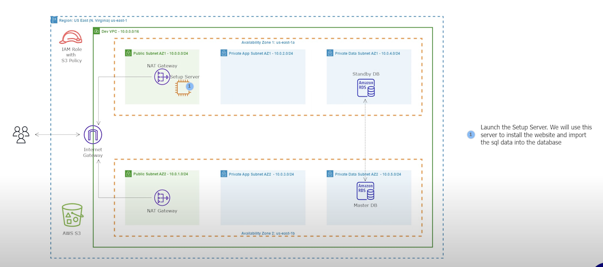

# 05 - Create a Key Pair and Setup an EC2 Instance

<!-- no toc -->
- [Using the AWS Console to Setup an EC2 Instance](#using-the-aws-console-to-setup-an-ec2-instance)
  - [Create a Key Pair](#create-a-key-pair)
  - [Launch an EC2 Instance in the Public Subnet](#launch-an-ec2-instance-in-the-public-subnet)

 

---

## Using the AWS Console to Setup an EC2 Instance 
We will be creating a key pair that will be used to SSH into the EC2 instance.

### Create a Key Pair
1. Go to the **EC2** AWS Service
2. Under **Network & Security** click `Key Pairs`
3. Click `Create key pair`
4. Input Variables:
    - Name: `virginia`
    - Key pair type: `RSA`
    - Private key file format: `.pem`
5. Click on `Create key pair`
6. The key pair will be downloaded to your computer. 

  

### Launch an EC2 Instance instance in the Public Subnet

The setup server will be used for 2 things:  
  - Import the SQL data for our application into the RDS DB
  - Install and configure our applicatio   
1. Go to the **EC2** AWS Service
2. Under **Instances** click `Instances`
3. Click `Launch instances`
4. Input Variables:
    - Name: `virginia`
    - Application and OS Images (Amazon Machine Image): `Amazon Linux 2 AMI (HVM) - Kernel 5.10, SSD Volume Type`
    - Private key file format: `.pem`
    - Instance type: `t2.micro`
    - Key pair (login): `virginia`
    - Network settings : Click `edit`
        - VPC: `Dev VPC`
        - Subnet: `Public Subnet AZ1`
        - Firewall (security groups):`Select existing security group`
            - Common security groups: `ALB Security Group`, `Webserver Security Group`, `SSH Security Group`
    - Advanced details : 
        - IAM instance profile: `AWSS3-FullAccess-Role`  

  

`AWSS3-FullAccess-Role`  is the role created in [04 - Create S3 Bucket and Upload File + IAM Roles with S3 Policy](04-S3-Bucket-and-Roles/Readme.md)

 

5. Review settings and Click on `Launch Instance`
6. Click on the Instance ID and make sure that the instance `Setup Server` is **running** and **Status Check** is **Initializing**

