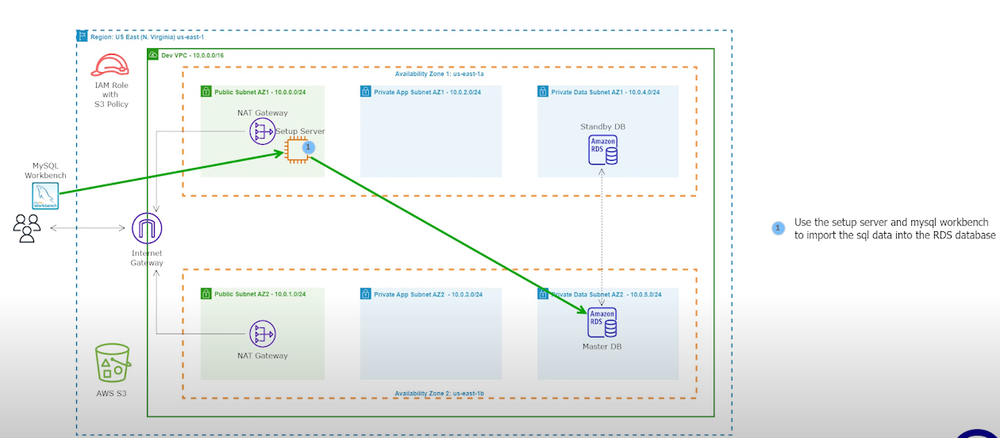
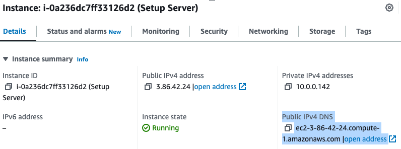
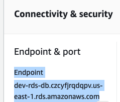
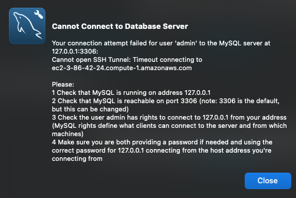
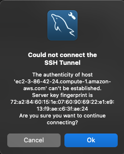
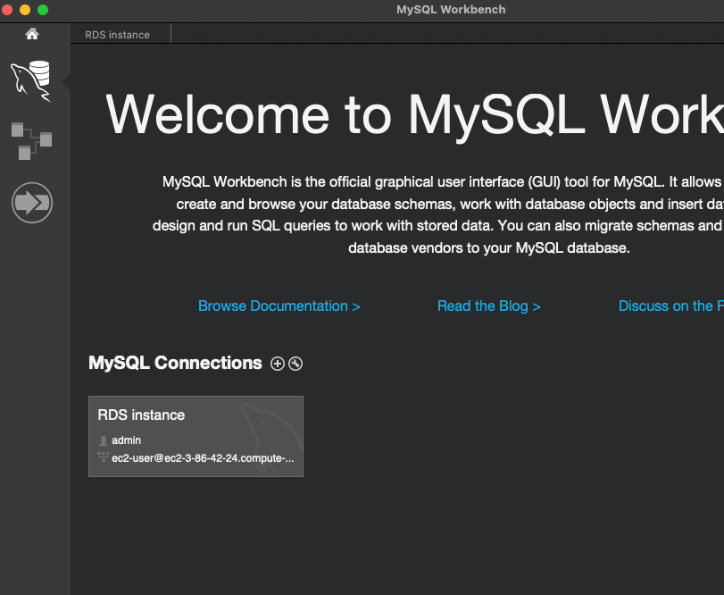
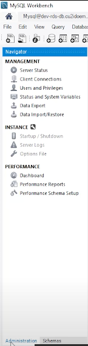
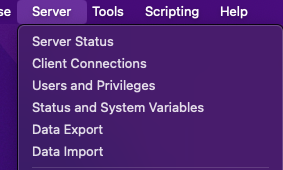
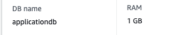

# 06 - Install and Setup MYSQL Workbench

<!-- no toc -->
- [Installing MySQL Workbench](#installing-mysql-workbench)
  - [Download and Install MySQL Workbench](#download-and-install-mysql-workbench)
  - [Setup the information for RDS and EC2](#setup-the-information-for-rds-and-ec2)
  - [Use MySQL Workbench to Import Data into an RDS Database](#use-mysql-workbench-to-import-data-into-an-rds-database)
  - [Import Data into the Database](#import-data-into-the-database)

 

---

## Installing MYSQL Workbench 

We will be installing MySQL Workbench in our machine and using the Setup Server and MySQL workbench to import the data to our instances in the AWS Console.

  

### Download and Install MySQL Workbench
1. [Install with Windows](https://www.youtube.com/watch?v=u96rVINbAUI)
2. [Install with Mac OS X](https://www.youtube.com/watch?v=sY_QPWiIeDQ&pp=ygUbaW5zdGFsbCBteXNxbCB3b3JrYmVuY2ggbWFj)

---

### Setup the information RDS and EC2 

Remember, the setup server will be used for 2 things:  
  - Import the SQL data for our application into the RDS DB
  - Install and configure our applicatio   
1. Download this [rentzone-db.sql file](https://drive.google.com/file/d/1Yush2bZk-ozg63i2px8iPcsPHIjNU1rY/view?usp=sharing) to your computer

We will need information from both:
-   the RDS DB  
-   the Setup EC2 Instance

to the SQL data for our application into the SQL database.

2. Go to the **EC2** AWS Service
3. On the Left side of the screen, under **Instances** click `Instances`
3. Check ✅ the box by `Setup Server` to see it's **Details**
   - QUICK TIP, TO AVOID ANY CONNECTION ISSUES, WHILE HERE:
      - Click on Actions
      - Click on Networking
      - Click on Connect RDS database
      - Choose the RDS Database
      - Click Connect
        

5. Right click on the AWS LOGO by the top left corner of the screen, and click `Open Link in New Tab`
6. In the new tab,go to the **Amazon RDS** AWS Service
7. On the left side of the column, select `Databases`
8. Click `dev-rds-db` 

---

### Use MySQL Workbench to Import Data into an RDS Database
1. Open the MySQL Workbench applciation on your machine
2. Look for and click `Connect to Database`
3. Input Variables:
    - Conection name: `RDS Instance`
    - Connection Method: `Standard TCP/IP over SSH`
    - SSH Hostname: `YOURS-IS-DIFFERENT.compute-1.amazonaws.com`
        - This will be the Public IPv4 DNS of the setup server
        
    - SSH Username: `ec2-user`
    - SSH Key File: locate the path to the [private key file](05-Create-a-KeyPair-and-Setup-an-EC2-Instance/Readme.md) and select it. 
        - This is a **.pem** file
    - MySQL Hostname: `YOURS-IS-DIFFERENT.us-east-1.rds.amazonaws.com` 
        - Go to the RDS Management Console Tab 
        - Under `dev-rds-db` , click **Connectivity & security** and under **Endpoint & port** select the value from Endpoint. 
       
        
   

    - MySQL Server Port: `3306`
    - Username: Type in your DB username, mine is `admin`
        - Go to the **Configuration** section
        - Under **Availability** you will see **Master username** , this will be your Username. 
        - Go to [03 - Launch a MySQL RDS Instance](03-Launch-a-MySQL-RDS-Instance/Readme.md) to Understand where this came form if still confused.
    - Password: 
        - Click `Store in Vault` or `Store in Keychain`
        - Type in your DB password, mine is `****👀****`
        - Click `OK`
    

4. You will get either of 2 things:
    - Error like below
        - Go to the `SSH Security Group` 
        - Click `Edit inbound rules`
        - Under **Source** , click `My IP`
            - It is likely you IP address changed  (Remember for maximum security, we chose this option feel free to change the **Source** to `Anywhere-IPv4`)   
        

    -  Warning like below:
        - It is okay to continue
        - Click `OK`
                 
5.  Instantiate the Database by clicking on RDS Instance
    

     

--- 

### Import Data into the Database
Once you are connected to the RDS database, ensure you are in the *Administration* tab for windows    
  

for mac , go to Server -> Data Import 
1. In MySQL Workbench applciation
2. The OS configuration is different:
    -   Windows - Under the administration tab click Data Import/Restore
    -   Mac - Click Server -> `Data Import`  
      
3. Select  **Import from Self-Contained File** , choose the `rentzone-db.sql` file you just downloaded from the computer
4. Under `Default Target Schema` , click the dropdown menu to select `applicationdb`
    `applicationdb` should correspond to the DB name we inputed when creating the database on RDS  
      
5. Click `Start Import`
6. Wait till the database import is complete and exit the application.
