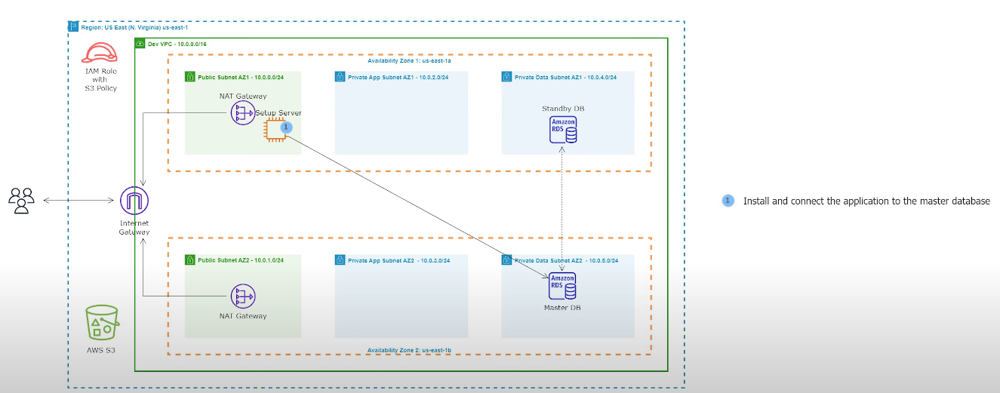
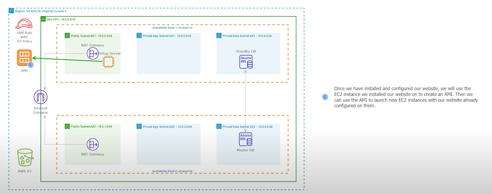

# 07 - Install a Dynamic Website on an EC2 Instance (Lamp Stack)


<!-- no toc -->
- [Setup the Server to Install and Configure the Website](#setup-the-server-to-install-and-configure-the-website)
- [Create a new AMI](#create-a-new-ami)


<br>

---

## Setup the Server to install and configure the website

We will be using the setup server to install and configure the website.
<br><br>


1. Go to the **EC2** AWS Service
2. in the left hnad menu, under **Instances** click `Instances`
3. Select `Setup Server`
4. Click on **Details** and copy the public IPv4 address 
5. SSH into the `Setup Server`
  - ```bash
    ssh -i "virginia.pem" ec2-user@3.86.42.24
    ```

6. Run the commands from the [install-rent-zone-ec2-commands.txt](install-rent-zone-ec2-commands.txt) file in this folder chronologically.
7. Copy the Public IPv4 address of the EC2 instance `Setup Server` - `3.86.42.24`
8. Paste it in you web browser, you should have access to the car rental website.


## Create a new AMI


Once we have installed and configured our website, we will use the EC2 instance we installed our website on to create an AMI. Then we can use the AMI to launch new EC2 instances with our website already configured on them.

1. Go to the **EC2** AWS Service
2. in the keft had menu, under **Instances** click `Instances`
3. Select `Setup Server`
4. Select **Actions**, Select **Image and templates** , then select `Create Image`
5. Input Variables:
    - Image name: `RentZone AMI`
    - Image description - optional: `ARentZone AMI`
    - Tags - optional: `Tag image and snapshots together`
    - Click Add new tag:
      - Key: `Name`
      - Value: `RentZone AMI`
6. Create Image
