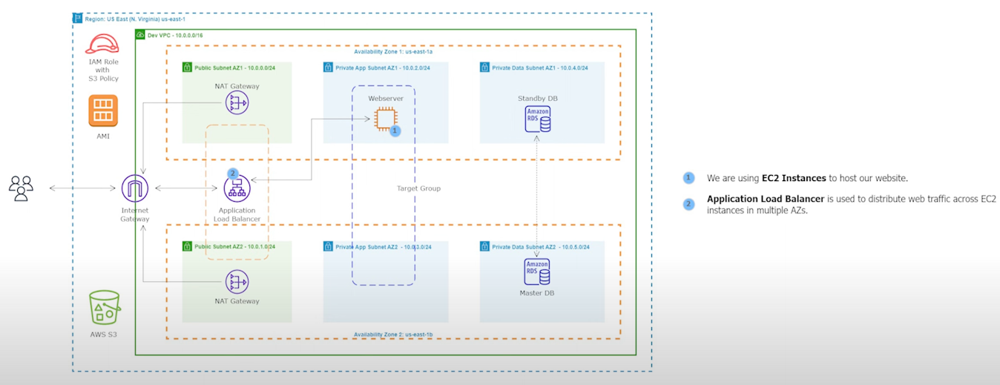

# 08 - Create an Application Load Balancer and Target Group

<!-- no toc -->
  - [Network Diagram for Application Load Balancer and Target Group](#network-diagram-for-application-load-balancer-and-target-group)
  - [Using the AWS Console to Setup the Website on the Private App Subnet](#using-the-aws-console-to-setup-the-website-on-the-private-app-subnet)
    - [Stop the Setup Server from the Public Subnet](#stop-the-setup-server-from-the-public-subnet)
    - [Launch an EC2 Instance in the Private Subnet](#launch-an-ec2-instance-in-the-private-subnet)
    - [Create a Target Group](#create-a-target-group)
    - [Create an Application Load Balancer](#create-an-application-load-balancer)

 

---

## Network Diagram for Application Load Balancer and Target Group 
    

 

---

## Using the AWS Console to Setup the website on the Private App Subnet

### Stop the Setup Server from the Public Subnet

We have accomplished what we need to do with the setup server. We can stop the server.
  

1. Go to the **EC2** AWS Service
2. in the left hand menu, under **Instances** click `Instances`
3. Select `Setup Server`
4. Click on **Instance state** and select `Stop Instance` 

---
 

### Launch an EC2 instance in the private subnet

The Web server will be used for:  
  - Running the Website   
1. Go to the **EC2** AWS Service
2. Under **Instances** click `Instances`
3. Click `Launch instances`
4. Input Variables:
    - Name: `Webserver AZ1`
    - Application and OS Images (Amazon Machine Image):
      - Select **My AMIs** 
      - under my AMIs, Select **Owned by me** 
      - Select `RentZone AMI`
    - Instance type: `t2.micro`
    - Key pair (login): `virginia`
    - Network settings : Click `edit`
        - VPC: `Dev VPC`
        - Subnet: `Private App Subnet AZ1`
        - Firewall (security groups):`Select existing security group`
            - Common security groups:  `Webserver Security Group`
5. Review the Summary 
6. Click `Launch instance`

---
 

### Create a Target Group
1. Go to the **EC2** AWS Service
2. in the left hnad menu, under **Load Balancing** click `Target Group`
3. Select `Create Target Group`
4. Input Variables:
    - Choose a target type: `Instances`
    - Target group name: `Dev-TG`
    - Protocol : Port: `HTTP:80`
    - VPC: `Dev VPC` (dont forget to change it)
    - Protocol version: `HTTP1
    - Health checks: 
      - Click **Advanced health check settings**
        - Success codes: `200, 301, 302`
      - Click **Next**
6. Click **Next**
7. Under **Register targets** > **Available instances**
  - Check the Webserver AZ1 ✅
8. Click **Include as pending below**
9. Make sure it transfers to **Review targets**
10. Click **Create target group**

---
 

### Create an Application Load Balancer
This would route traffic to the target group
1. Go to the **EC2** AWS Service
2. in the left hand menu, under **Load Balancing** click `Load Balancers`
3. Select `Create Load Balancer`
4. Under **Application Load Balancer**, click `Create`
5. Input Variables:
    - Load balancer name: `Dev-ALB`
    - Scheme: `Internet-facing`
    - IP address type: `IPv4`
    - Network mapping: 
      - VPC: `Dev VPC` (dont forget to change it)
      - Mappings: 
        - us-east-1a 
          - Public Subnet AZ1
        - us-east-1b 
          - Public Subnet AZ2
    - Security groups: 
      - Security groups: `ALB Security Group`
    - Listeners and routing:
      - Default action: `Dev-TG` 
      We are only creating an HTTP listener for now
6. Click **Create Application Load Balancer**
7. Wait for the state to go from **Provisioning** to **Active**
8. Copy the **DNS name** and use it to access the website
9. Once you confirm the **DNS name** can be used to access the website, go to your **EC2 instances** and **TERMINATE** the `Setup Server` instance. There is no longer any need for the setup server.

