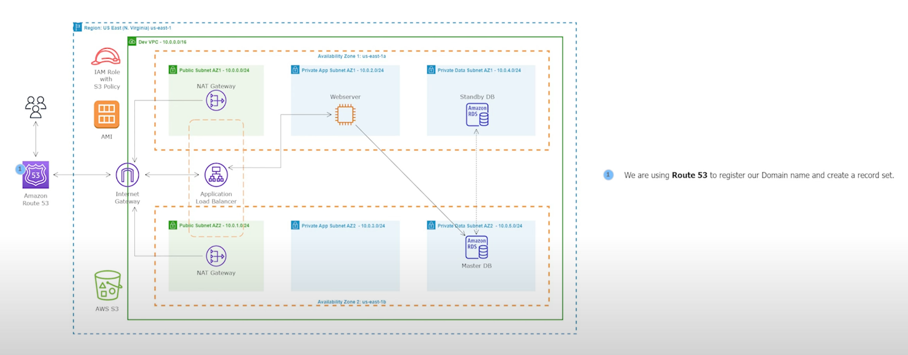
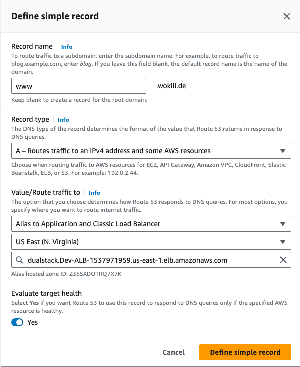
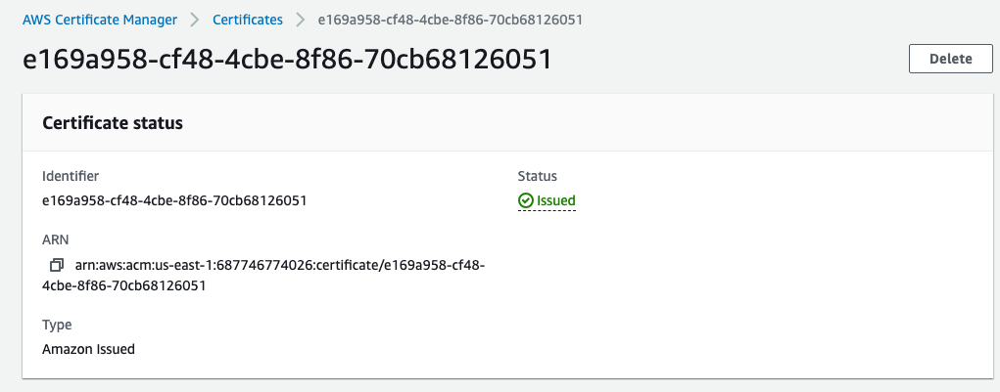
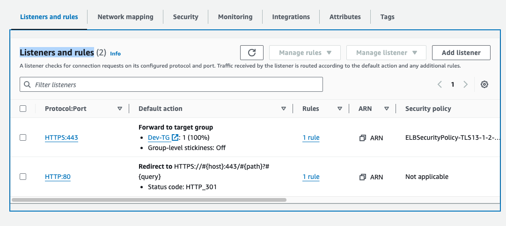

# 09 - Register a New Domain Name in Route 53

<!-- no toc -->
- [Using the AWS Console to Register a New Domain Name in Route 53](#using-the-aws-console-to-register-a-new-domain-name-in-route-53)
  - [Register the New Domain Name with Route 53](#register-the-new-domain-name-with-route-53)
  - [Create a Record Set in Route 53](#create-a-record-set-in-route-53)
  - [Create and Register an SSL Certificate in AWS Certificate Manager](#create-and-register-an-ssl-certificate-in-aws-certificate-manager)
- [Secure the Website](#secure-the-website)
  - [Add Listener to the ALB and Attach the ACM SSL Certificate](#add-listener-to-the-alb-and-attach-the-acm-ssl-certificate)
  - [Redirect HTTP Traffic to HTTPS (Port 80 to Port 443)](#redirect-http-traffic-to-https-port-80-to-port-443)

 

---

## Using the AWS Console to Register a New Domain Name in Route 53

### Register the new domain name with Route 53

1. Go to the **Route 53** AWS Service
2. in the left hand menu, click `Dashboard`
3. Under **Register domain** , input the website domain you would like to register, to ensure that the domain is available.
    - Type the domain you would like to register
    - Click `Check`
    - If it is available, click `Continue`
    - Enter your `Contact Details` to continue the registration
    - Ensure to Enable **Privacy Protection**
    - Click `Continue`
    - Click to accept if you want an annual enablement for the domain 
    - Accept the terms and conditions
4. Click `Complete Order` 
5. Ensure the Domain is registered by:
    - Go to the **Route 53** AWS Service
    - in the left hand menu, click `Dashboard`
 

---

### Create a Record Set in Route 53

 

1. Go to the **Route 53** AWS Service
2. in the left hand menu, click `Hosted Zones`
3. Select the domain name hyperlink
4. Select **Records** , click `Create record`
5. Ensure it is set to **Switch to quick create**
6. Under **Quick create record** , Input Variables:
    - Record name:
        - Subdomain: `www`
    - Alias: `✅`
    - Route traffic to: 
        - Endpoint: `Alias to Application and Class Load Balancer`
        - Region: `US East (N. Virginia)`
        - Choose load balancer: `Dev-ALB`
    You can also use Routing Policy , Simple Routing (see image below)
7. Click `Create records` 
8. Wait till the status of the record is ready
9. Select the record just created (it is usually of type A)
10. Copy **Record name** and paste it in a website.

  

---

### Create and register an SSL Certificate in AWS Certificate Manager
We will be:
-   Creating an SSL Certificate in AWS Certificate Manager
- Linking the Certificate with the record set in Route 53

 

1. Go to the **Certificate Manager** AWS Service
2. in the **AWS Certificate Manager** console, click `Request a Certificate`
3. Under **Certificate type** , click `Next`
4. Under **Request public certificate** , Input Variables:
    - Fully qualified domain name: 
        - `wokili.de`  
            - This is the domain name you just created
    - click `Add another name to this certificate`
        - `*.wokili.de`
            - This adds the wildcard to the domain name.
5. Click `Request` 
6. View the certificate, ensuring that the status says `Pending Validation`
7. Under **Domains**, click `Create records in Route 53`
8. Under **Create DNS records in Amazon Route 53** make sure both domain (in my case `wokili.de` and `*.wokili.de`) are selected.
9. Click `Create Records`
10. Refresh the webpage until the status says `Issued`

      

---

## Secure the Website 

### Add Listner to the ALB and attach the ACM SSL Certificate
We will be:
-   Adding a new listner in our ALB that listens to traffic from ***Port 443***

At this point the communication between the website and web browser is not secure, we will need to secure it with an SSL certificate. 
 

1. Go to the **EC2** AWS Service
2. Under **Load Balacing** console, click `Load Balancers`
3. Select the `Dev-ALB` checkbox ✅
4. Under **Load balancer: Dev-ALB** , then under **Listeners and rules** click `Add listner` 
5.Input Variables:
    - Protocol : Port: `HTTPS:443`
    - Default actions -> Routing actions : `Redirect` 
    - Target group: `Dev-TG`
    - Default SSL/TLS server certificate -> From ACM: 
      - Click `Default SSL/TLS server certificate`

5. Click `Add` 
6. Ensure you have 2 listeners on the ALB, both should be forwaring traffic to the targert group

---
### Redirect HTTP traffic to HTTPS (Port 80 to Port 443)

1. Go to the **EC2** AWS Service
2. Under **Load Balacing** console, click `Load Balancers`
3. Select the `Dev-ALB` checkbox ✅
4. Under **Load balancer: Dev-ALB** , then under **Listeners and rules**
    - Check the box beside HTTP:80 ✅
5. Click **Manage Listener** , select `Edit Listener`
6.Input Variables:
    - Protocol : Port: `HTTPS:443`
    - Default actions -> Routing actions : `Redirect to URL` 
        - Protocol: `HTTPS`
        - Port: `443`
5. Click `Save changes` 
6. Go back to **Listeners and rules** for `Dev-ALB`, ensure it looks like the image below. (It should be forwaridn traffic)

7. Go to the website and you would it is now secure, but the website looks funky. This will be fixed in the next section.

