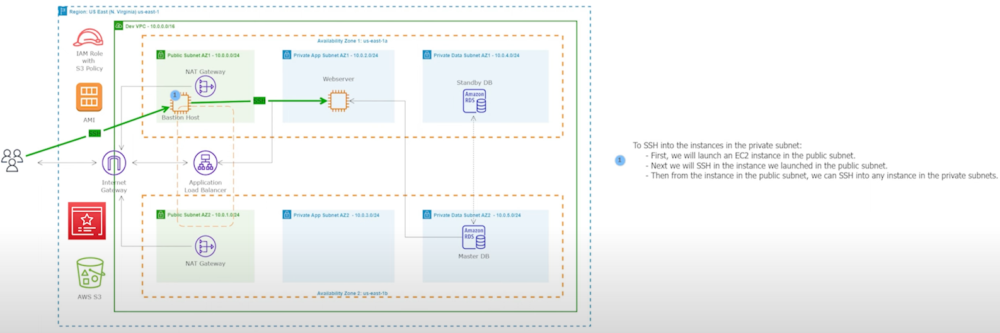
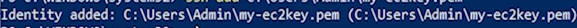

# 10 - SSH Into an EC2 Instance in the Private Subnet


<!-- no toc -->
- [Architectural Diagram](#architectural-diagram)
- [Using the AWS Console to SSH into the Private Subnet](#using-the-aws-console-to-ssh-into-the-private-subnet)
  - [Create a Bastion Server](#create-a-bastion-server)
  - [SSH into Bastion Host Instance with Agent Forwarding](#ssh-into-bastion-host-instance-with-agent-forwarding)
  - [SSH into the Webserver in the Private Data Subnet with the Bastion Host Instance](#ssh-into-the-webserver-in-the-private-data-subnet-with-the-bastion-host-instance)
- [Create a New AMI](#create-a-new-ami)


<br>

---
## Architectural Diagram




## Using the AWS Console to SSH into the Private Subnet
Since the webserver is lcoated in the private app subnet, we need to setup a **Bastion Host** server to connect to the Webserver. Follow the steps below for the configuraton process:

### Create a Bastion Server

The setup server will be used for 2 things: <br>
  - Import the SQL data for our application into the RDS DB
  - Install and configure our applicatio <br><br>
1. Go to the **EC2** AWS Service
2. Under **Instances** click `Instances`
3. Click `Launch instances`
4. Input Variables:
    - Name: `Bastion Host`
    - Application and OS Images (Amazon Machine Image): `Amazon Linux 2 AMI (HVM) - Kernel 5.10, SSD Volume Type`
    - Private key file format: `.pem`
    - Instance type: `t2.micro`
    - Key pair (login): `virginia`
    - Network settings : Click `edit`
        - VPC: `Dev VPC`
        - Subnet: `Public Subnet AZ1`
        - Auto-assign Public IP: `Enable`
        - Firewall (security groups):`Select existing security group`
            - Common security groups:  `SSH Security Group`
5. Click `Launch Instance`
<br> 


---

### SSH into Bastion Host instance with Agent Forwarding

Agent forwarding allows you to use your local SSH key to securely connect from your machine to a bastion host and then to a private EC2 instance without storing your key on the intermediate hosts. It simplifies secure access to private resources. Eliminating the need to copy your key to each intermediate host manually; this enhances security and convenience when accessing private resources in a VPC.

ssh-agent for windows allows for a seamless ssh connection. 
1. If using windows:
    - open powershell as an administrator
    - use the commands located in the file, [SSH-into-instance-in-the-private-subnet-windows.md](https://github.com/victorwokili/AWS-Advanced/blob/main/Host-a-Dynamic-Web-Application-on-AWS/10-SSH-Into-an-EC2-Instance-in-the-Private-Subnet/SSH-into-instance-in-the-private-subnet-windows.md)  to load the `KeyPair` into the SSH agent.
    you should get this image <br>
     <br>
    - exit out of powershell
    - Open powershell normally 
    - go to step 3

2. If using a mac:
    - open terminal
    - use the commands located in the file, [SSH-into-instance-in-the-private-subnet-mac.md](https://github.com/victorwokili/AWS-Advanced/blob/main/Host-a-Dynamic-Web-Application-on-AWS/10-SSH-Into-an-EC2-Instance-in-the-Private-Subnet/SSH-into-instance-in-the-private-subnet-mac.md)  to load the `KeyPair` into the SSH agent.
   - you should get this image <br>
    <br>
   - go to step 3
<br>


3. Type:
    - `ssh -A ec2-user@184.72.107.116` 

4. Type `yes` and press enter to continue connection.


### SSH into the Webserver in the Private Data Subnet with the Bastion Host instance 
1. Go to the **EC2** AWS Service
2. in the keft had menu, under **Instances** click `Instances`
3. Select `Webserver AZ1`
4. Select **Details**
5. Copy the **Private IPv4 addresses** to the clipboard `10.0.2.100`
6. Paste the `10.0.2.100` (yours is different) to the Bastion Host Instance Terminal, your code should look like this:
    - ```bash
        ssh ec2-user@10.0.2.100 
      ```
        OR

        ```bash
            ssh 10.0.2.100 
        ```
7. Update the configuration file to reflect the changes made to the website (.env file)
    - Change the .env file:
        - type:
            ```bash      
            cd /var/www/html 
            ```
        - press enter to continue
        - type:
            ```bash      
            sudo nano .env
            ```
        - press enter to continue
        - change the `APP_ENV` variable from `local` to `production`
        - change the `APP_URL` variable from `` to `https://www.wokili.de` 
            - This is the domain name of your website, copy it from the URL bar.
            - Feel free to remove the `\` at the end of the URL
            - Make sure it is `https://`

        - type ctrl+x to exit
        - type y and then press enter

        ```
8. Update the file in the app directory (.env file)
    - Change the .env file:
        - type:
            ```bash      
            cd /var/www/html/app/Providers/
            ```
        - press enter to continue
        - type:
            ```bash      
            sudo nano AppServiceProvider.php
            ```
        - press enter to continue
        - add `if (env('APP_ENV') === 'production') {\Illuminate\Support\Facades\URL::forceScheme('https');}`  to the codebase by changing 
            ``` bash
                public function boot()
                {
                    //set whatever level you want
                error_reporting(E_ALL ^ E_NOTICE);
                }          
            ```
            *************************************to*************************************
             ```bash
                public function boot()
                { 
                    if (env('APP_ENV') === 'production') {\Illuminate\Support\Facades\URL::forceScheme('https');}

                    //set whatever level you want
                error_reporting(E_ALL ^ E_NOTICE);
                }
             ```   

        
        - ensure `if (env('APP_ENV') === 'production') {\Illuminate\Support\Facades\URL::forceScheme('https');}` is formatted properly as seen in the 2nd code block below. 
            - If you messed the code above, use the [public-function-boot.sh](public-function-boot) file fix it.
        - type ctrl+x to exit
        - type y and then press enter
9. Restart the Apache service
    ```bash
    sudo service httpd restart
    ```
10. Go to the website again and refresh 
11. It should come up properly


## Create a new AMI


Once we have installed and configured our website for HTTPS, we will use the EC2 instance we installed our website on to create an AMI. Then we can use the AMI to launch new EC2 instances with our website already configured on them.

1. Go to the **EC2** AWS Service
2. in the keft had menu, under **Instances** click `Instances`
3. Select `Webserver AZ1`
4. Select **Actions**, Select **Image and templates** , then select `Create Image`
5. Input Variables:
    - Image name: `RentZone AMI Version 2`
    - Image description - optional: `RentZone AMI Version 2`
    - Tags - optional: `Tag image and snapshots together`
    - Click Add new tag:
      - Key: `Name`
      - Value: `RentZone AMI Version 2`
6. Create Image
