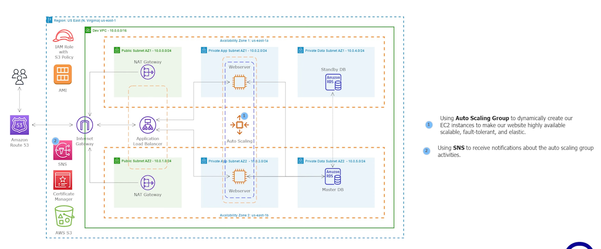

# 10 - Create an Auto Scaling Group

<!-- no toc -->
- [Architectural Diagram](#architectural-diagram)
- [Using the AWS Console to Create an Auto Scaling Group](#using-the-aws-console-to-create-an-auto-scaling-group)
  - [Terminate the EC2 Instances](#terminate-the-ec2-instances)
  - [Create a Launch Template](#create-a-launch-template)
  - [Create an ASG](#create-an-asg)
  - [Using Amazon SNS for Auto Scaling Group Notifications](#using-amazon-sns-for-auto-scaling-group-notifications)

 

---
## Architectural Diagram

## Using the AWS Console to Create an Auto Scaling Group

In the context of hosting a web server in a private application subnet for a website, using an Auto Scaling Group offers several benefits:

- **Highly Available:** The Auto Scaling Group ensures there are always a specified number of EC2 instances (web servers) running. If one instance fails, the group automatically replaces it, minimizing downtime and keeping your website highly available.

- **Scalable:** You can define scaling policies based on traffic patterns or metrics. When traffic increases, it automatically adds new EC2 instances to handle the load, and when traffic decreases, it can remove instances to save costs.

- **Fault-Tolerant:** In case an EC2 instance becomes unhealthy or unresponsive, the group identifies and replaces it with a healthy one, enhancing fault tolerance.

- **Elastic:** Auto Scaling allows your infrastructure to adapt to changing demands, automatically scaling up or down as needed. This makes your infrastructure more elastic and cost-efficient.

By using an Auto Scaling Group for your web servers in the private application subnet, you create a resilient and efficient infrastructure that can handle varying levels of traffic while maintaining high availability and fault tolerance. This setup helps ensure your website remains accessible and responsive to users.

### Terminate the EC2 Instances

1. Go to the **EC2** AWS Service
2. Under **Instances** click `Instances`
3. Click the checkbox for all related instances
4. Click **Instance state** and then `Terminate instance`

  
--- 

### Create a Launch Template
1. Go to the **EC2** AWS Service
2. Under **Instances**, click `Launch Template`
3. Click `Create Launch Template`
4. Input Variables:
    - Launch template name - required: `Dev-Launch-Template`
    - Template version description: `Dev-Launch-Template V1`
    - Auto Scaling guidance - ✅
    - Application and OS Images (Amazon Machine Image) : `RentZone AMI Version 2`
    - Instance type: `t2.micro`
    - Key pair (login): `virginia`
    - Network settings : Click `edit`
        - VPC: `Dev VPC`
        - Subnet: `Public Subnet AZ1`
        - Auto-assign Public IP: `Enable`
        - Firewall (security groups):`Select existing security group`
            - Common security groups:  `Webserver Security Group`
5. Click `Create Lauch Template`
6. Click `View Launch Template`

  
--- 

### Create an ASG
1. Go to the **EC2** AWS Service
2. Under **Auto scaling group**, click `Auto scaling group`
3. Click `Create Auto scaling group`
4. Input Variables:
    - Auto Scaling group name: `Dev-ASG`
    - Launch template: `Dev-Launch-Template`
5. Click `Next`
6. Input Variables:
    - VPC: `Dev VPC`
    - Availability Zones and subnets: `Private App Subnet AZ1`, `Private App Subnet AZ2`
7. Click `Next`
8. Input Variables:
    - Load balancing :  `Attach to an existing load balancer`
    - Attach to an existing load balancer -> Choose from your load balancer target groups: `Dev-TG`
    - Health checks: `Turn on Elastic Load Balancing health checks ✅`
    - Additional settings:
        - Monitoring: `Enable group metrics collection within CloudWatch`
9. Click `Next`
10. Input Variables:
    - Group size: 
        -  Desired capacity: `2`
    - Scaling: 
        - Min desired capacity: `1`
        - Max desired capacity: `2`
    -Automatic scaling: `No scaling policies`
11. Click `Next`

## Using Amazon SNS for Auto Scaling Group Notifications

Amazon SNS (Simple Notification Service) can be used to receive notifications about your Auto Scaling Group's activities. This integration allows you to stay informed about key events, including scaling operations, instance terminations, and policy executions. By leveraging SNS, you proactively monitor and manage your infrastructure, ensuring optimal performance and high availability.

12. Under **Add notifications - optional** click `Add Notification`

13. Input Variables:
    - Notification 1: 
        -  SNS Topic: click `Create a Topic`
            - Send a notification to - `my-sns-topic`
            - With these recipients - `👀@😭.com`
14. Click `Next`
15. Add Tag:
    - Key: `Name`
    - Value: `ASG-Webserver`
    - Tag new instances: ``
16. Click `Next`
17. Review
18. Click `Create Auto scaling group`